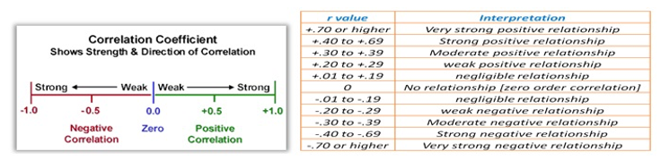

## Correlation Analysis

Explain the relationship between variables of interest.

$$
r = \frac {N\sum{XY}-(\sum{X}\sum{Y})}{\sqrt{ [N\sum{x^2}-(\sum{x})^2 ][N\sum{y^2}-(\sum{y})^2 }]}
$$



**Load the Data**

Water stress is one of the major abiotic factors that limit crop production and quality. Seed priming is a pre-sowing treatment that enhances seed performance under stress conditions. The aim of this study was to investigate the effects of water stress and seed priming on grain yield (gy) and its components.The dataset comprises 2 factor variables and 9 response or observed variables, alongside a variable denoting the repetitions of each experimental unit. The initial three observed variables (aba, apx, and pod) provide insights into the activity of phytohormones. Additionally, the variable “ph” represents the height of the plants. Lastly, the remaining variables (til, pl, grp, tgw) fall under the

```{r}
library(readxl)
data_corr <- read_excel("data_corr.xlsx")
```

```{r}
library(AgroR)
```

```{r}
corgraph(data_corr[4:12], axissize = 9, legendsize = 9, 
         size.tile.lty = .3, size.label.cor = .3)
```

```{r}
library(metan)
```

```{r}
plot(corr_coef(data_corr[4:12]))
```

```{r}
library(Path.Analysis)
```

```{r}
corr_plot(data_corr[4:12])
```

### **Key Observations:**

1.  **Strong Positive Correlations (≥ 0.85)**:

    -   **`aba` (Abscisic acid?)** shows very strong associations with:

        -   **`apx`** (0.91*), **`pod`** (0.92*), **`til`** (0.86*), **`pl`** (0.85*), **`grp`** (0.85*), **`tgw`** (0.83*), and **`gy`** (0.87\*\*).

    -   **`apx` (Antioxidant enzyme?)** correlates highly with **`pod`** (0.96*), **`til`** (0.87*), **`pl`** (0.88*), **`grp`** (0.94*), **`tgw`** (0.91\*), and **`gy`** (0.89\*\*).

    -   **`grp` (Grains per plant/pod?)** is strongly linked to **`pl`** (0.95*), **`tgw`** (0.93*), and **`gy`** (0.86\*\*).

2.  **Moderate Correlations (0.45–0.74)**:

    -   **`ph` (Plant height)** has weaker but significant ties to other traits (e.g., 0.45\* with **`til`**, 0.74\* with **`pl`**).

3.  **Weakest Correlation**:

    -   **`ph`** and **`til`** (0.45\*) show the lowest (but still significant) relationship.

4.  **Grain Yield (`gy`)**:

    -   Highly correlated with most traits, especially **`grp`** (0.86**), `tgw` (0.85**), and **`til`** (0.86\*\*).

5.  **Statistical Significance**:

    -   **`*`** = Significant at \*p\* \< 0.05; **`**`** = Highly significant at \*p\* \< 0.01.

### **Implications:**

1.  **Trait Prioritization for Breeding**:

    -   Focus on **`grp`**, **`tgw`**, and **`til`** (strongest links to **`gy`**). For example:

        -   Higher **`grp`** (grains per pod/plant) and **`tgw`** (thousand-grain weight) likely drive yield.

        -   **`til`** (tillers?) also strongly influences yield (0.86\*\*).

2.  **Redundancy in Traits**:

    -   **`apx`**, **`pod`**, and **`aba`** are highly intercorrelated (0.91–0.96\*). Measuring one may suffice to represent the group.

3.  **Plant Height (`ph`)**:

    -   Less critical for yield (weakest correlations), but still contributes indirectly (e.g., via **`pl`** or **`til`**).

4.  **Biological Pathways**:

    -   The strong **`aba`**-**`apx`**-**`pod`** cluster suggests stress-response traits (e.g., abscisic acid and antioxidants) are tightly linked to reproductive structures (**`pod`**) and yield.

## Path Analysis

In the field of statistical analysis, **Structural Equation Modeling (SEM)** is a powerful tool used to analyze complex relationships between variables. It allows researchers to explore both direct and indirect effects among multiple variables simultaneously.

```{r}
matdiag(data_corr[4:12], 9, verbose = T)
```

### **Key Observations:**

1.  **Non-Significant (ns) Direct Effects**:

    -   All path coefficients are marked as "ns" (non-significant), meaning **none of the traits** have statistically significant (\*p\* \< 0.05) *direct* effects on the target variable.

    -   Example paths:

        -   **`til`** → Target: 0.0063 ns

        -   **`ph`** → Target: 0.0089 ns

        -   **`pod`** → Target: 0.0989 ns

        -   **`apx`** → Target: 0.1927 ns

        -   **`tgw`** → Target: 0.1672 ns

        -   **`aba`** → Target: e-4019 (negligible).

2.  **Residual Effect (Unexplained Variance)**:

    -   **0.3865 (38.65%)**: Indicates that \~39% of the variation in the target variable is **not explained** by the included traits. This suggests:

        -   Missing key variables (e.g., environmental factors, management practices).

        -   Complex interactions (e.g., trait synergies) not captured by direct paths.

3.  **Notable (But Non-Significant) Paths**:

    -   **`apx`** (0.1927) and **`tgw`** (0.1672) show the strongest *numerical* (but non-significant) direct effects.

    -   **`gp`** (e-3555) and **`aba`** (e-4019) have near-zero effects.

### **Implications:**

1.  **No Single Trait Directly Drives the Target**:

    -   Unlike the earlier correlation table (where traits like **`grp`** and **`tgw`** strongly correlated with **`gy`**), this analysis shows **no direct causal links**.

    -   The discrepancy suggests traits influence the target **indirectly** (e.g., through intermediate variables like Biological Yield).

2.  **Need for Indirect Path Analysis**:

    -   Use **mediation analysis** or **structural equation modeling (SEM)** to explore:

        -   If **`apx`** or **`tgw`** affect **`gy`** via other traits (e.g., **`pod`** or **`grp`**).

        -   Interactions between traits (e.g., **`til`** × **`ph`**).

3.  **High Residual Variance**:

    -   Address by:

        -   Adding critical missing traits (e.g., root architecture, stress indices).

        -   Incorporating environmental data (e.g., rainfall, soil quality).

4.  **Contrast with Correlation Results**:

    -   The earlier correlation table showed strong associations (e.g., **`grp`**–**`gy`** = 0.86\*\*), but path analysis reveals these relationships may be **mediated or confounded**.

### **Conclusion & Recommendations:**

-   **Breeding/Management**: Focus on **trait combinations** (e.g., select for high **`tgw`** *and* **`apx`**) rather than individual traits.

-   **Research Next Steps**:

    -   Expand the model to include indirect paths and interactions.

    -   Validate findings with field trials or multi-environment data.

-   **Statistical Caution**: Non-significance may reflect small sample size or high variability—check statistical power.

**Note**: If **`gfp`** (possibly "grain filling period") is the target, its residual variance (38.65%) highlights the need to explore physiological or climate-related drivers.

## Path Analysis using lavaan

### **Performing SEM**

#### **Model Specification**

The first step in SEM is to specify the model. I used the lavaan package to write the model syntax. The model consisted of two latent variables (EA and YC) and one observed variable (gy). The latent variables were defined by their indicators using the `=~` operator. The observed variable was regressed on the latent variables using the `~` operator.

```{r}
mod.id <- '
EA =~ aba + apx + pod
YC =~ til + pl + grp + tgw
gy ~ EA + YC
'
```

#### **Model Estimation and Identification**

After specifying the model, we can proceed with estimating the parameters and identifying the model’s fit. The `lavaan` package is used for this purpose. The following code snippet performs model estimation:

```{r}
library(lavaan)
```

```{r}
mod.est <- sem(
          model = mod.id,
          data = data_corr
)
```

```{r}
summary(mod.est, fit.measures = T)
```

The `sem()` function estimates the parameters of the specified model using the provided data. The `summary()` function then provides a summary of the estimated model, including the estimated coefficients, standard errors, p-values, and fit indices.

Additionally, you can obtain fit measures by modifying the code snippet as shown below. This will provide additional fit measures such as the Comparative Fit Index (CFI), Root Mean Square Error of Approximation (RMSEA), and others.

### **Interpreting model results**

**Model Test:**

The user model’s chi-square test statistic is 23.193 with 18 degrees of freedom, resulting in a p-value of 0.183. This indicates that the user model fits the data reasonably well, as a higher p-value suggests a better fit. The baseline model’s chi-square test statistic is 278.306 with 28 degrees of freedom and a p-value of 0.000. The significant difference between the user model and the baseline model suggests that the user model provides a better fit.

**Fit Indices:**

The Comparative Fit Index (CFI) is 0.979, indicating a good fit of the user model. A CFI value close to 1 indicates a better fit. The Tucker-Lewis Index (TLI) is 0.968, also indicating a good fit. Similar to CFI, TLI values close to 1 indicate a better fit.

**Loglikelihood and Information Criteria:**

The loglikelihood of the user model is -258.507, while the loglikelihood of the unrestricted model is -246.911. A higher loglikelihood indicates a better fit. Information criteria such as Akaike Information Criterion (AIC), Bayesian Information Criterion (BIC), and Sample-size adjusted Bayesian Information Criterion (SABIC) are provided as well. Lower values of these criteria indicate a better fit.

**Root Mean Square Error of Approximation (RMSEA):**

The RMSEA is 0.127, which suggests a reasonable fit of the model. The 90% confidence interval for RMSEA ranges from 0.000 to 0.259. A smaller RMSEA value and a narrower confidence interval indicate a better fit. However, the p-values for testing the null hypotheses regarding RMSEA are 0.223 and 0.711, indicating that the model does not significantly deviate from a perfect fit.

**Standardized Root Mean Square Residual (SRMR):**

The SRMR is 0.024, which is below the commonly accepted threshold of 0.08. This suggests a good fit of the model, as smaller values indicate better fit.

**Parameter Estimates:**

The parameter estimates provide information about the relationships between latent variables and observed variables. For example, the estimated regression coefficient of gy on EA is 3.644 with a standard error of 1.843 and a p-value of 0.048. Similarly, the regression coefficient of gy on YC is 0.082 with a standard error of 1.034 and a p-value of 0.937.

The estimated covariation between EA and YC is 6.341 with a standard error of 2.359 and a p-value of 0.007. The variances of the latent variables and the observed variables are also provided. For example, the estimated variance of EA is 3.767 with a standard error of 1.443 and a p-value of 0.009.

In summary, the SEM analysis results indicate that the user model fits the data reasonably well. The fit indices, loglikelihood, RMSEA, and SRMR suggest a good fit. The parameter estimates provide insights into the relationships between latent and observed variables in the model.

### **Path Diagram**

The final step was to visualize the model using a path diagram. I used the `semPlot` package to draw the path diagram with different options.

```{r}
library(semPlot)
```

```{r}
semPaths(
          object = mod.est,
          what = "path",
          whatLabels = "par"
)
```

This code snippet creates a basic path diagram displaying the paths between latent and observed variables. You can adjust the appearance of the path diagram by modifying various parameters like style, layout, rotation, size, and color.

For example, the following code generates a path diagram in a tree layout:

```{r}
P <- semPaths(
          object = mod.est,
          what = "path",
          whatLabels = "par",
          style = "ram",
          layout = "tree",
          rotation = 2,
          sizeMan = 7,
          sizeLat = 7,
          color = "lightblue",
          edge.label.cex = 1.2,
          label.cex = 1.3
)
```

### **Interpretation of the Path Diagram**

-   The path diagram provides a graphical representation of the SEM model. It distinguishes observed variables (enclosed in squares or rectangles) from latent variables (represented by circles or ellipses).

-   The single-headed arrows, known as paths, indicate the causal relationships between variables. The variable at the tail of the arrow influences or causes the variable at the head. These paths help us understand how variables interact within the model.

-   The double-headed arrows represent the covariance between variables. When two variables are connected by a double-headed arrow, it indicates that they share a common underlying factor or are directly related to each other. The double-headed arrows pointing to the same variable reflect the variances associated with that variable.

However, in some cases, these variances may be omitted if the variables are standardized to have a unit variance. The path diagram visually represents the structural relationships, including causality, covariance, and variances, between the observed and latent variables in the SEM model.

### **Conclusion**

This blog post provided a detailed explanation of implementing Structural Equation Modeling (SEM) in R. We covered the steps involved, including clearing the R environment, importing data, specifying the model, estimating parameters, and creating a path diagram. The path diagram serves as a valuable tool for visualizing and interpreting the relationships between variables in the SEM model. By leveraging SEM in R, researchers can gain deeper insights into complex relationships and make informed decisions based on their findings.
